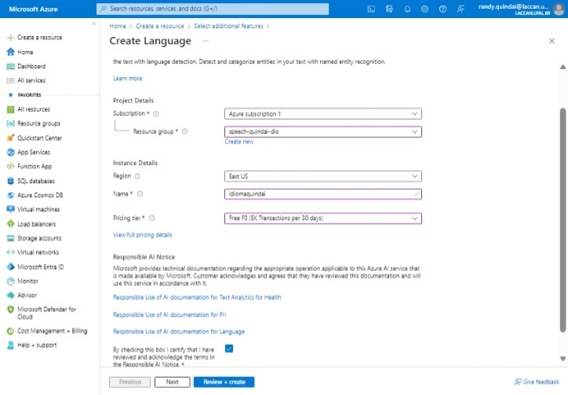
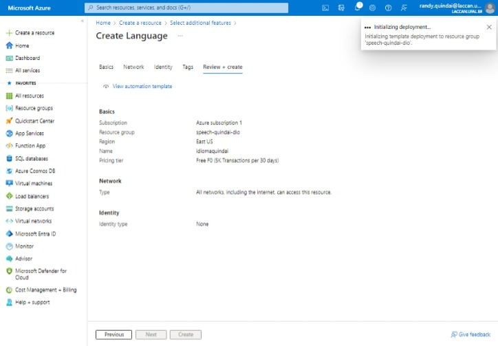
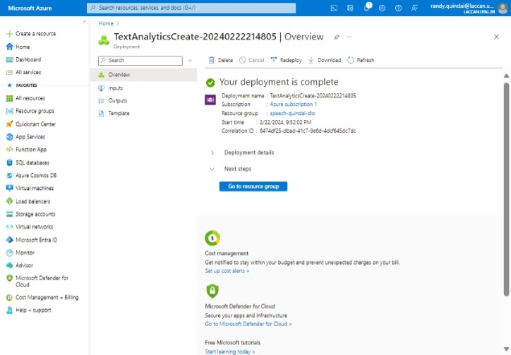
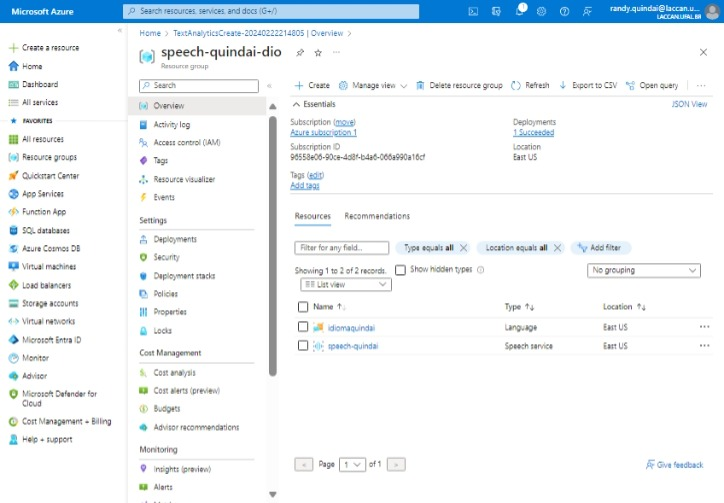
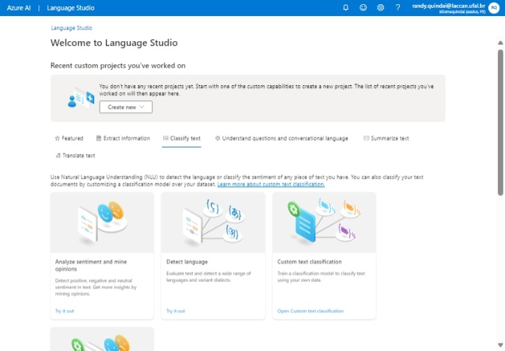
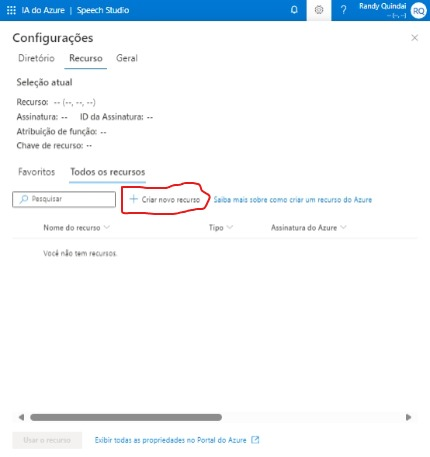
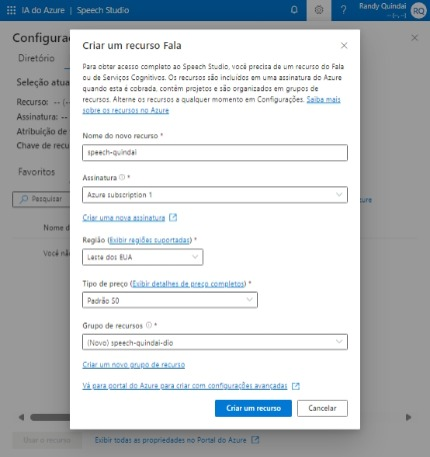
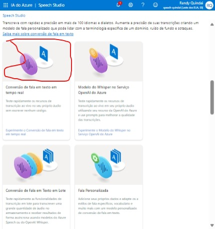

# NLP com Azure Cognitive Services for Language | Speech
O recurso de tradução de fala para texto em tempo real está muito bem feito, preço um pouco salgado, mas em breve deverá baratear.

Para saber mais com um tutorial rápido, siga esse endereço https://learn.microsoft.com/pt-br/azure/ai-services/language-service/sentiment-opinion-mining/quickstart?tabs=windows&pivots=programming-language-csharp.

Se você for desenvolvedor(a) e quiser se aprofundar com o SDK, siga esse endereço https://github.com/Azure/azure-sdk-for-python/tree/main/sdk/textanalytics/azure-ai-textanalytics/samples.

É muito intrigante pensar nas possibilidades envolvendo as barreiras da língua falada entre os países, parece que será um problema do passado. Imagina, entrar numa videochamada, cada um falando na sua língua nativa e o algoritmo traduzindo em tempo real. O serviço da Azure faz isso em tempo real, apenas falta uma integração com os aplicativos de videochamada.

Esse repositório simplesmente apresenta o meu react em texto sobre as tecnologias do Azure Language Studio - https://language.cognitive.azure.com/ e do Speech Studio - https://speech.microsoft.com/.

Os artefatos estão armazenados na pasta [`inputs`](https://github.com/quindai/mlai9003/tree/main/inputs).

Para usar os serviços de Linguagem, você precisará iniciar no portal da Azure (https://portal.azure.com).

| | | |
|:-------------------------:|:-------------------------:|:-------------------------:|
| Criar recurso para o Azure Language|  ||
|  |   | |

Você pode seguir os passos a seguir para replicar os mesmos resultados com os inputs disponibilizados, mas seguindo o tutorial oficial já é suficiente, porque a plataforma é simples e fácil de usar.

| Passo 1 no Speech Studio | Passo 2 no Speech Studio | 
| ----------------------------------- | ----------------------------------- |
|  |  |

| Passo 3 no Speech Studio | Passo 4 no Speech Studio | 
| ----------------------------------- | ----------------------------------- |
|  | 

